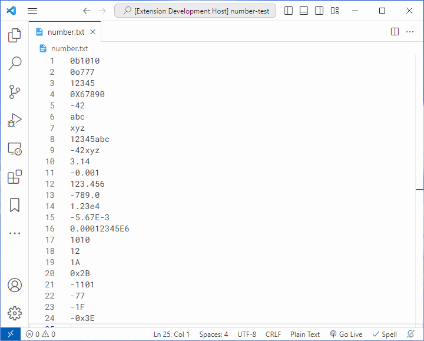
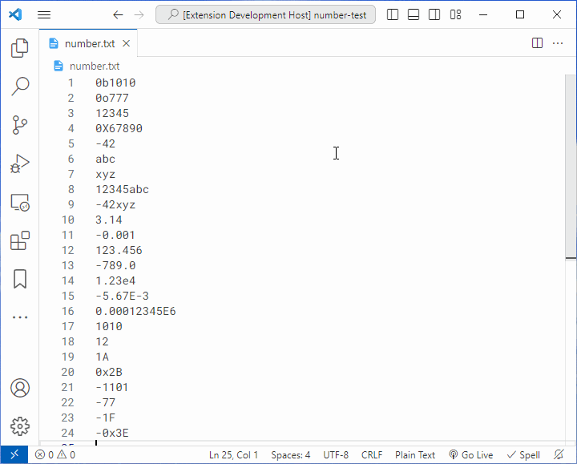
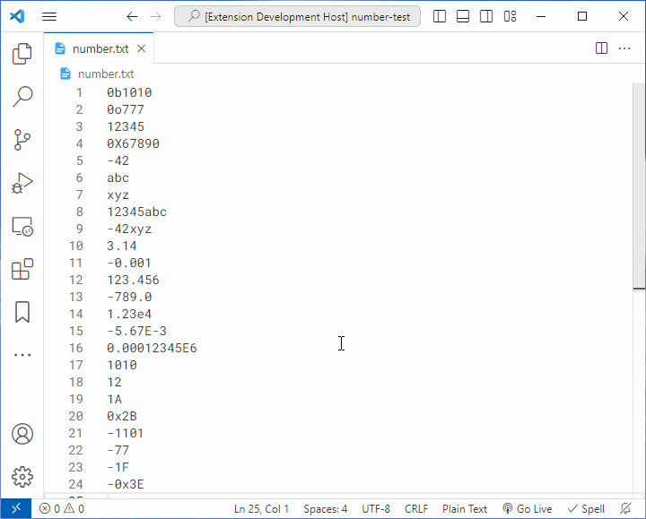

# Number Literal

A VSCode extension that can convert/hover different representations of Number Literal.

## Features

- Hovering shows different representations of numbers.
- Commands are provided to convert numbers to other representations.

## Requirements

- VS Code [`1.64.0`](https://code.visualstudio.com/updates/v1_64) or higher

## Extension Settings

N/A

## Usage

Hovering over a valid number literal will display various representations of that number:

When the focus is on a valid number literal (selection/cursor), calling commands can convert it to other representations:

Of course, you can also handle multiple valid number literals at the same time:

## Known Issues

Run into a bug? Report it [here](https://github.com/dsyx/number-literal/issues).

## Release Notes

Detailed release notes are available [here](https://github.com/dsyx/number-literal/releases).